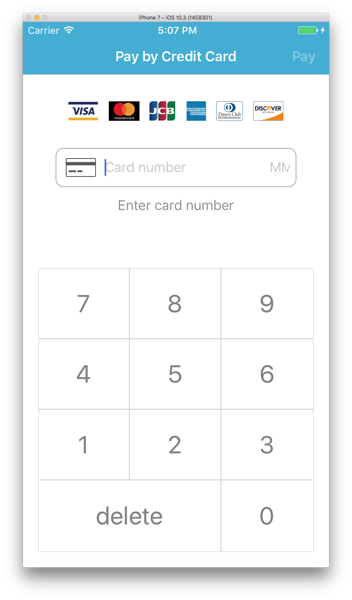

# Plastic

A collection of credit card-related widgets for iOS apps.

## Overview

The Plastic framework contains the following UI components.

(It doesn't do any actual payment processing.)

### CYCardBrandListView

`CYCardBrandListView` shows a list of accepted card brands, any combination of Visa, MasterCard, JCB, American Express, Diners Club, and Discover logos.

### CYCardEntryView

`CYCardEntryView` facilitates entering a credit card number, expiration, and card verification code.

The card number is Luhn-checked, and the expiration is checked against the current date.  Text is shown in red if either checks fail.

The CVC field accepts four digits for American Express, and three otherwise.

Once the user has finished entering their information, the embedding app is notified by a `CYCardEntryViewDelegate` method, at which point the information can be sent over to a payment processor.

### CYKeypad

`CYKeypad` is a numeric keypad widget that can be used with `CYCardEntryView` or for any other application that requires numerical input.

## Usage

See the sample app in `Plastic.xcodeproj` for an example of how to add Plastic to your project.  It demonstrates the functionality of all three widgets.

## Requirements

* Xcode 8
* iOS 8.0 and above
